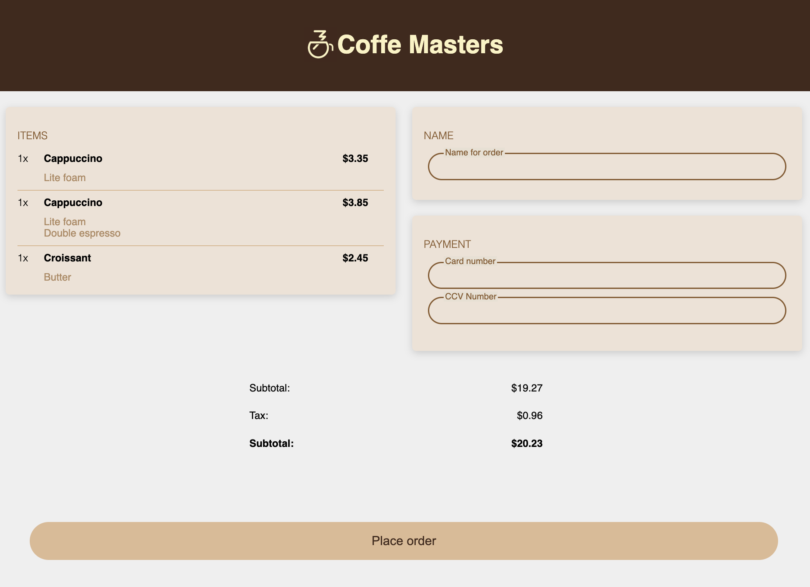
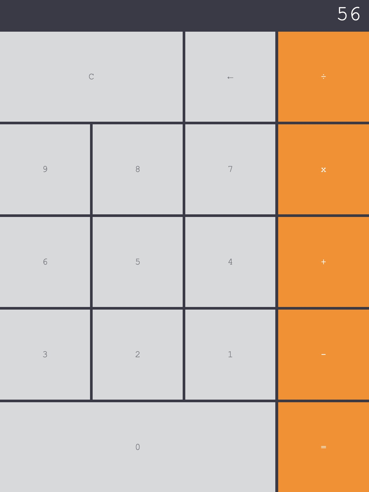
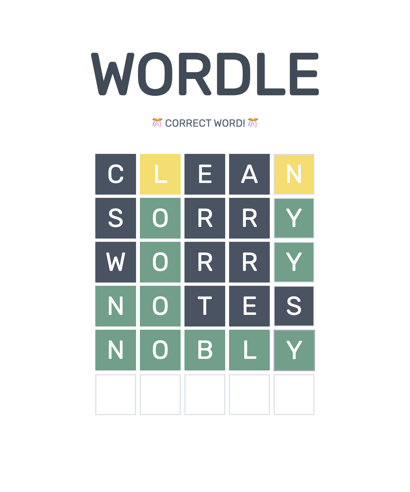

# Web site creation with Frontend Masters
Project from the online course on Web Design from Frontend Masters

## CSS Project
The final result must resemble the UI on the left. The resul of my implementation is depicted on the right
Expected                   | Mine
:-------------------------:|:-------------------------:
  | 

## Calculator

My result for the calculator assignment using `css`, `html` and `javascript` is as follows:

## WORDLE

The project's focus was to implement a WORDLE-like game. The challenges to be practiced were interacting with APIs using the `GET` and `POST` commands.

